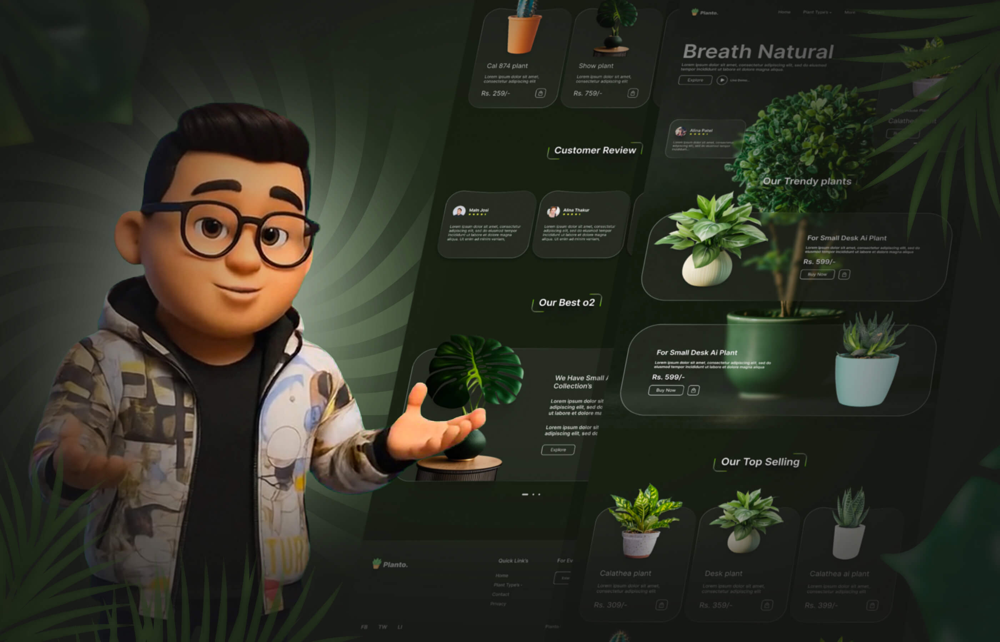

<div align="center">
<h1 align="center">🌵 Planto – Responsive eCommerce plants Website Template</h1>
Planto is a fully responsive eCommerce plants website template, designed to work seamlessly on all devices. Built with HTML, CSS, TypeScript, Tailwind css, and React + Vite, this template is optimized for performance, scalability, and a modern UI/UX.
<br />
<br />
<a href="https://planto.pages.dev/"><strong>➥ Live Demo</strong></a>
<br />
</div>

## Demo



## programming language and tools

<p>
   <a href="#">
    
   </a>
</p>

## Prerequisites

Before you begin, ensure you have met the following requirements:

- [Git](https://git-scm.com/downloads "Download Git") must be installed on your operating system.

## Installing Planto

To install **Planto**, follow these steps:

Windows:

```bash
git clone https://github.com/ahmed-abd-alalim/Planto.git
cd Planto
npm i
npm run dev
```

## Pages

- 🏠 Home – Stunning landing page for plants

## Features

<p>✅ Fully Responsive – Adapts to all screen sizes</p>
<p>✅ React + Vite – Fast and efficient development setup</p>
<p>✅ Tailwind css 4  – Modern and flexible UI components</p>
<p>✅ Optimized Performance – Lightweight and fast loading</p>

## Contact

<p align="left">
  <a href="https://www.linkedin.com/in/ahmed-abd-alalim-286768299/" target="_blank"></a>
</p>

## License

This program has been licensed under the MIT License. If you are a true FOSS (Free And Open Source Software) Lover, you wont customize this and redistribute this under your name
